# Rapport labo 2 CLD

---

Auteurs : Amir Mouti et Harun Ouweis

Groupe : GrP

Date : 09.04.2024


## Tâche 1 : Création d'une base de données Amazon RDS

Pour cette tâche, nous avons créé une instance de base de données Amazon RDS pour héberger la base de données de notre application Wordpress. Cela remplace notre précédente configuration où la base de données était hébergée directement sur notre instance EC2.

### Délivrables

- **Coût mensuel estimé pour la base de données RDS :** Nous avons configuré une instance RDS MySQL 8.0.36 avec les spécifications suivantes : db.t3.micro, 20 GB de stockage SSD General Purpose, avec l'accès public activé et sans sauvegarde automatique. Le coût estimé pour cette configuration est de 11 USD par mois. 
nous obtenons ce résultat en faisant prix de l'instance par mois ainsi que prix du stockage : 0.17 USD * 24 * 30 + 20 * 0,115 USD par Go/mois = 12.24 USD + 2.3 USD = 14.54 USD.

- **Comparaison des coûts avec une instance EC2 :** Le coût d'une instance EC2 db.t2.micro en exécution continue avec la même allocation de stockage est d'environ 9 USD par mois. Les détails de calcul sont 0,0116 USD * 24 * 30 + 0,08 USD * 8 = 8,352 USD + 0,64 USD = 8,992 USD.
- 
 Cela montre que le service RDS ajoute une prime pour ses fonctionnalités de gestion de base de données, mais justifie cela par les avantages en termes de sauvegarde automatique, de réplication de données et de failover.

- **Argumentation pour et contre l'utilisation de RDS vs EC2 :** 
  - **Pour l'utilisation de RDS :** La gestion simplifiée des bases de données, les sauvegardes automatiques, la réplication des données, et le failover automatique. Ces fonctionnalités réduisent le besoin d'une gestion manuelle et peuvent améliorer la disponibilité et la fiabilité de l'application.
  - **Contre l'utilisation de RDS :** Le coût peut être légèrement plus élevé en comparaison à l'exécution d'une base de données sur une instance EC2, et il y a moins de contrôle sur la configuration et la version du système de gestion de base de données.

- **Adresse de point de terminaison de la base de données :** L'adresse de point de terminaison de notre instance RDS est `grp-harun-wordpress-db.crsk2uw660uh.us-east-1.rds.amazonaws.com`.

Utilisateur et mot de passe pour l'accès à la base de données RDS : Nous avons choisi un utilisateur `GrP_Harun` et un mot de passe `OuweisAmir123.`. 

## Tâche 2 : Configuration du Wordpress pour utiliser la base de données RDS

### Délivrables

Nous avons configuré l'instance Wordpress master pour utiliser la base de données RDS au lieu de la base de données MySQL locale. Cette étape est cruciale pour assurer la scalabilité de notre application en séparant les couches de présentation et de logique métier de la couche de données.

**Configuration de la base de données dans `wp-config.php` :**

Nous avons modifié les paramètres de configuration de la base de données dans le fichier `wp-config.php` pour pointer vers notre instance RDS :

```php
 * @package WordPress
 */

// ** Database settings - You can get this info from your web host ** //
/** The name of the database for WordPress */
define( 'DB_NAME', 'wordpress-db' );

/** Database username */
define( 'DB_USER', 'GrP_Harun' );

/** Database password */
define( 'DB_PASSWORD', 'OuweisAmir123.' );

/** Database hostname */
define( 'DB_HOST', 'grp-harun-wordpress-db.crsk2uw660uh.us-east-1.rds.amazonaws.com' >
```

Ces modifications permettent à notre site Wordpress de communiquer avec la base de données hébergée sur Amazon RDS, bénéficiant ainsi des avantages en termes de performance, de disponibilité et de sécurité offerts par le service RDS.


## Tâche 3 : Création d'une image virtuelle personnalisée

### Délivrables

Nous avons créé une image virtuelle personnalisée de notre instance Wordpress. Cette image contient toute la configuration nécessaire pour exécuter Wordpress connecté à notre base de données Amazon RDS, facilitant le déploiement de nouvelles instances Wordpress scalables.

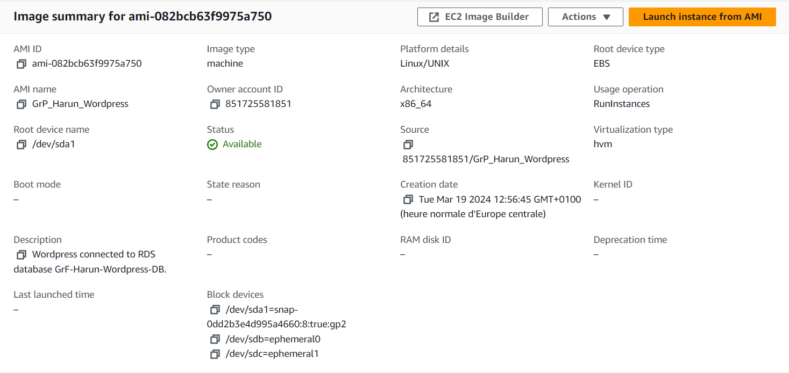

Cette image nous permettra de déployer rapidement et efficacement de nouvelles instances Wordpress, assurant une meilleure gestion de la charge et de la scalabilité de notre application.


## Tâche 4 : Création d'un équilibreur de charge (Load Balancer)

### Délivrables

Nous avons mis en place un équilibreur de charge Application Load Balancer dans AWS pour notre application Wordpress. Cela permet de distribuer le trafic entre les instances de manière efficace, améliorant la disponibilité et la réactivité de notre site.

**DNS Name (A Record) du Load Balancer :** `GrP-Harun-LoadBalancer-1355098285.us-east-1.elb.amazonaws.com`

```yaml
ubuntu@ip-172-31-90-86:~$ nslookup GrP-Harun-LoadBalancer-1355098285.us-east-1.elb.amazonaws.com
Server:         127.0.0.53
Address:        127.0.0.53#53

Non-authoritative answer:
Name:   GrP-Harun-LoadBalancer-1355098285.us-east-1.elb.amazonaws.com
Address: 44.219.222.74
Name:   GrP-Harun-LoadBalancer-1355098285.us-east-1.elb.amazonaws.com
Address: 3.212.52.144
```
- **Adresse(s) IP résolue(s) :** `3.212.52.144`

**Accès de vérification de santé dans le journal d'accès Apache :**

Voici quelques exemples d'entrées de journal indiquant des accès de vérification de santé effectués par le Load Balancer :

```php
185.144.39.29 - - [19/Mar/2024:11:40:51 +0000] "POST /wp-login.php HTTP/1.1" 200 3133 "http://54.89.244.233/wp-login.php" "Mozilla/5.0 (Windows NT 10.0; Win64; x64) AppleWebKit/537.36 (KHTML, like Gecko) Chrome>185.144.39.29 - - [19/Mar/2024:11:41:04 +0000] "POST /wp-login.php HTTP/1.1" 200 3133 "http://54.89.244.233/wp-login.php" "Mozilla/5.0 (Windows NT 10.0; Win64; x64) AppleWebKit/537.36 (KHTML, like Gecko) Chrome>54.89.244.233 - - [19/Mar/2024:11:41:14 +0000] "GET / HTTP/1.1" 200 3423 "-" "WordPress/6.4.3; http://54.89.244.233"
54.89.244.233 - - [19/Mar/2024:11:41:14 +0000] "GET / HTTP/1.1" 200 3423 "-" "WordPress/6.4.3; http://54.89.244.233"
54.89.244.233 - - [19/Mar/2024:11:41:14 +0000] "GET / HTTP/1.1" 200 3423 "-" "WordPress/6.4.3; http://54.89.244.233"
54.89.244.233 - - [19/Mar/2024:11:40:33 +0000] "POST /wp-cron.php?doing_wp_cron=1710848433.1450099945068359375000 HTTP/1.1" 200 259 "-" "WordPress/6.4.3; http://54.89.244.233"
```


---

## Tâche 5 : Lancement d'une seconde instance et connexion à l'équilibreur de charge

### Délivrables

#### Diagramme de Configuration

Le diagramme suivant illustre la configuration de notre infrastructure cloud, montrant comment les composants sont interconnectés, incluant les instances, la base de données, l'équilibreur de charge, et les clients. Les groupes de sécurité sont également représentés pour indiquer où les paquets sont filtrés :

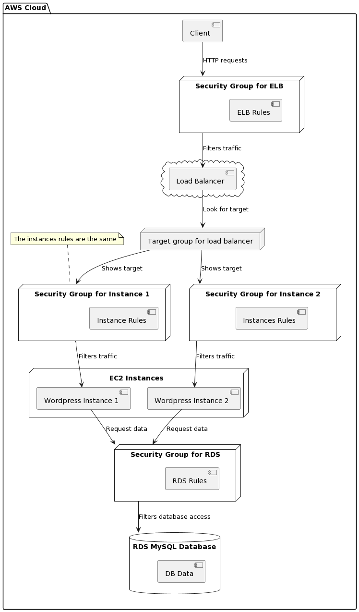

#### Coût Mensuel Estimé

Nous avons calculé une estimation du coût mensuel pour cette configuration, en prenant en compte les éléments suivants :

- **2 Instances EC2 (t3.micro)**
- **1 Instance RDS (db.t3.micro)**
- **1 Équilibreur de charge (Application Load Balancer)**

L'estimation du coût mensuel pour cette configuration, en excluant les coûts de trafic et en se basant sur des prix moyens observés sur AWS, se présente comme suit :

- **Coût pour les instances EC2 :**  8,992 * 2 = 17.98 USD (pour deux instances, détails au délivrable de la Tâche 1)
- **Coût pour l'instance RDS :** 14.54 USD (détails au délivrable de la Tâche 1)
- **Coût pour l'équilibreur de charge :** 0.0225 USD par heure * 24 * 30 = 16.2 USD

Le coût total mensuel estimé pour l'ensemble de la configuration est de 17.98 + 14.54 + 16.2 = 48.72 USD .


---


## Tâche 5b : Gestion de l'Équilibreur de Charge

### Délivrables

Nous documentons ici les commandes utilisées pour supprimer l'équilibreur de charge existant, le recréer, et ensuite recréer les écouteurs associés.

**1. Suppression de l'équilibreur de charge :**


```bash
aws elbv2 delete-load-balancer --load-balancer-arn <value>
```

<value> -> arn:aws:elasticloadbalancing:us-east-1:851725581851:loadbalancer/app/GrP-Mouti-LoadBalancer/b767b8f41bd53af7

**2. Recréation de l'équilibreur de charge :**


```bash
aws elbv2 create-load-balancer --name GrP-Mouti-LoadBalancer --subnets subnet-07f74df2f9ca79cef subnet-0a2ab628966261f50 --security-groups sg-0816887f7f66df111 --scheme internet-facing --type application --ip-address-type ipv4
```

**Resultat:**
```json
{
    "LoadBalancers": [
        {
            "LoadBalancerArn": "arn:aws:elasticloadbalancing:us-east-1:851725581851:loadbalancer/app/GrP-Mouti-LoadBalancer/3e3c5b247114f18b",
            "DNSName": "GrP-Mouti-LoadBalancer-1117589140.us-east-1.elb.amazonaws.com",
            "CanonicalHostedZoneId": "Z35SXDOTRQ7X7K",
            "CreatedTime": "2024-03-28T11:29:26.670000+00:00",
            "LoadBalancerName": "GrP-Mouti-LoadBalancer",
            "Scheme": "internet-facing",
            "VpcId": "vpc-049e2f8e56e0bafef",
            "State": {
                "Code": "provisioning"
            },
            "Type": "application",
            "AvailabilityZones": [
                {
                    "ZoneName": "us-east-1c",
                    "SubnetId": "subnet-07f74df2f9ca79cef",
                    "LoadBalancerAddresses": []
                },
                {
                    "ZoneName": "us-east-1d",
                    "SubnetId": "subnet-0a2ab628966261f50",
                    "LoadBalancerAddresses": []
                }
            ],
            "SecurityGroups": [
                "sg-0816887f7f66df111"
            ],
            "IpAddressType": "ipv4"
        }
    ]
}
```


**3. Recréation de l'écouteur :**


```bash
aws elbv2 create-listener --load-balancer-arn <value> --protocol HTTP --port 80 --default-actions Type=forward,TargetGroupArn=arn:aws:elasticloadbalancing:us-east-1:851725581851:targetgroup/GrP-Mouti-TargetGroup/2436cf89a396c952
```

**Resultat :**
```json
{
    "Listeners": [
        {
            "ListenerArn": "arn:aws:elasticloadbalancing:us-east-1:851725581851:listener/app/GrP-Mouti-LoadBalancer/3e3c5b247114f18b/39bfbe065143c99c",
            "LoadBalancerArn": "arn:aws:elasticloadbalancing:us-east-1:851725581851:loadbalancer/app/GrP-Mouti-LoadBalancer/3e3c5b247114f18b",
            "Port": 80,
            "Protocol": "HTTP",
            "DefaultActions": [
                {
                    "Type": "forward",
                    "TargetGroupArn": "arn:aws:elasticloadbalancing:us-east-1:851725581851:targetgroup/GrP-Mouti-TargetGroup/2436cf89a396c952",
                    "ForwardConfig": {
                        "TargetGroups": [
                            {
                                "TargetGroupArn": "arn:aws:elasticloadbalancing:us-east-1:851725581851:targetgroup/GrP-Mouti-TargetGroup/2436cf89a396c952",
                                "Weight": 1
                            }
                        ],
                        "TargetGroupStickinessConfig": {
                            "Enabled": false
                        }
                    }
                }
            ]
        }
    ]
}
```
---

## Tâche 6 : Test de l'application distribuée

**Résolution du nom DNS de l'équilibreur de charge :**
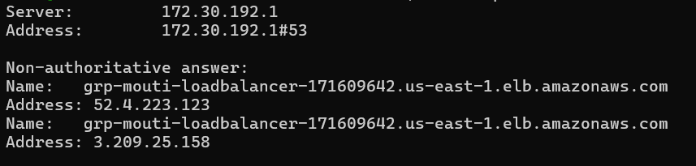


Lors de la résolution du nom DNS de l'équilibreur de charge, nous observons d'abord le serveur qui nous a donné la réponse, suivi des adresses IP correspondant au nom DNS de l'équilibreur de charge. La réponse est "non-authoritative" parce que le serveur qui a répondu n'est pas le serveur autoritaire du domaine.

**Observations générales :**

### 50 requêtes par seconde

Le premier test de charge avec les paramètres par défaut.

La charge s'avère déjà trop élevée pour le système à 50 requêtes par seconde. En examinant les fichiers de logs des connexions SSH, la charge semblait être répartie également entre les deux instances avant que l'instance créée à partir de l'image ne tombe en panne. Le taux de réussite est inférieur à 50%, ce qui semble indiquer que les deux instances ont rencontré des problèmes, en supposant que la charge était répartie uniformément durant les 60 secondes.

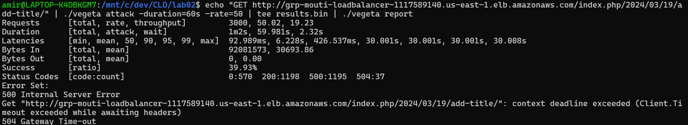

Nous pouvons observer avec l'outil de surveillance AWS que l'instance qui est tombée en panne durant le test de charge avait un pourcentage d'utilisation du CPU beaucoup plus élevé, ce qui pourrait être la raison de sa panne. Le nombre de paquets et de bytes reçus est également beaucoup plus faible parce qu'elle a cessé de fonctionner assez rapidement (en regardant le graphique de Vegeta, il semble qu'elle soit tombée environ 7-8 secondes après le début du test de charge).

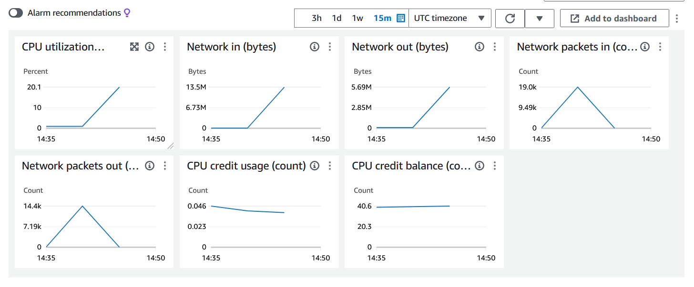
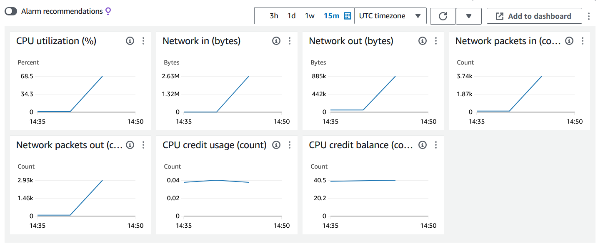
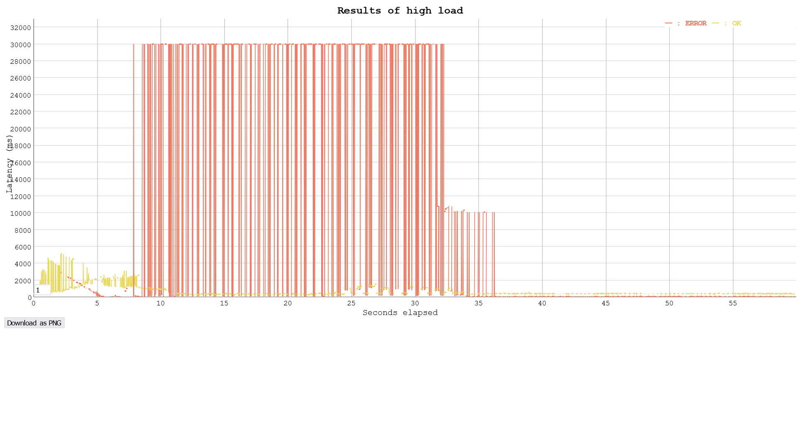

Durant le test de charge, l'instance créée à partir de l'image est devenue "unhealthy", la connexion SSH a été interrompue et n'a pas pu être rétablie. Il a fallu l'arrêter et la redémarrer pour qu'elle fonctionne correctement à nouveau.

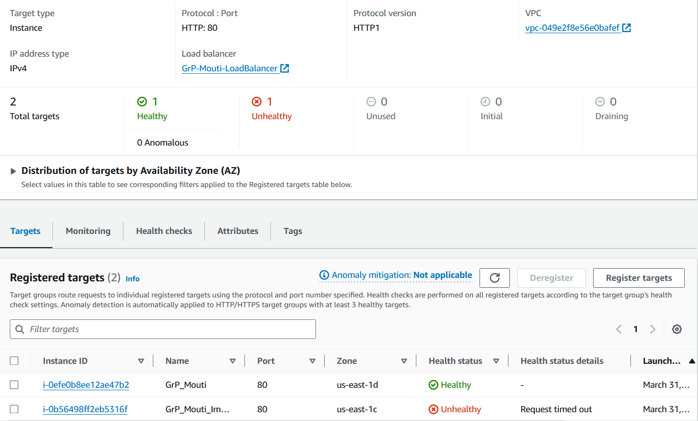

Le résultat de nslookup sur l'équilibreur de charge après le test de charge de 50 requêtes par seconde reste le même qu'avant, AWS ne l'a pas étendu.

### 15 requêtes par seconde

Puisque les paramètres par défaut ont déjà causé une panne de l'instance, nous avons effectué des tests de charge avec des taux de requêtes par seconde plus faibles au lieu d'augmenter la charge. Nous avons réalisé un test de charge à 15 puis à 30 requêtes par seconde.

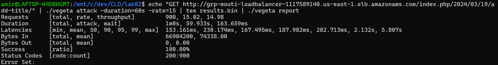
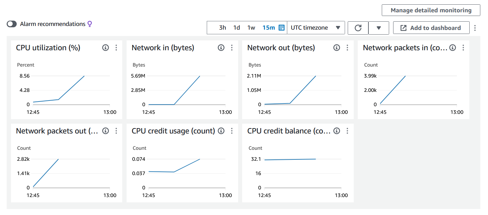
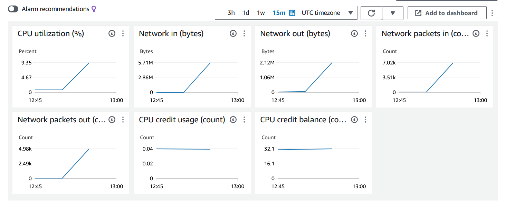
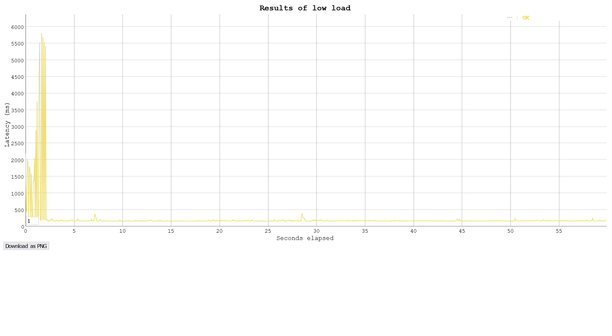

### 30 requêtes par seconde

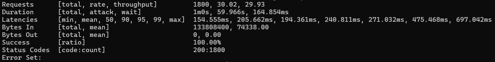
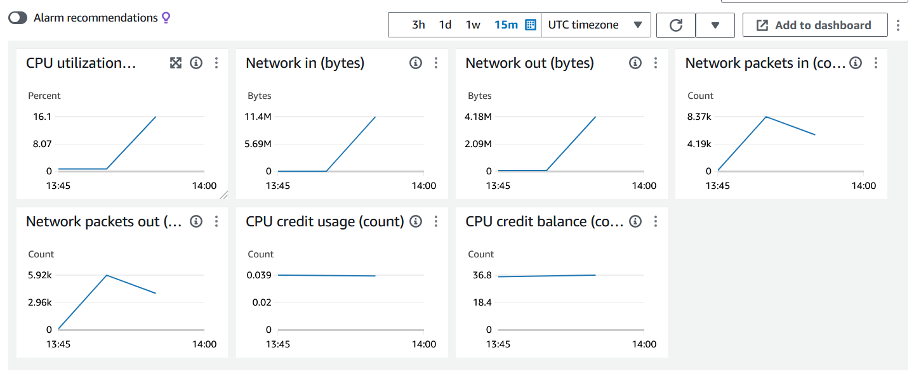
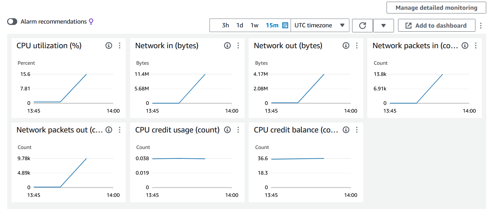
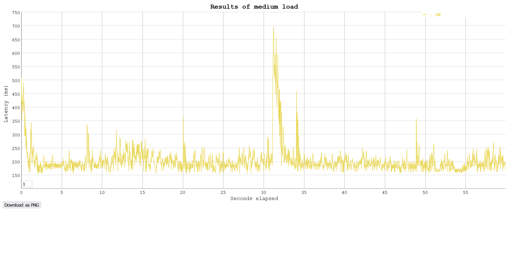

À un taux de 15 et 30, la charge est bien gérée par les instances et l'équilibreur de charge avec un taux de réussite de 100%.

Les latences, tant à 15 qu'à 30 requêtes par seconde, sont globalement similaires (à part les 2-3 premières secondes du test à 15 qui montrent des latences plus élevées que la normale). Nous pouvons voir à partir de la surveillance AWS que la charge réseau en octets est répartie également entre les deux instances pour les deux tests, bien qu'une des instances ait reçu plus de paquets dans les deux cas. La raison de cela n'est pas claire.

Nous pouvons constater que le nombre de paquets réseau et la quantité d'octets doublent comme prévu en passant de 15 à 30 requêtes par seconde. L'utilisation du CPU semble également augmenter proportionnellement (au moins pour ces valeurs de test) au nombre de requêtes et double plus ou moins.

**Évaluation du test d'équilibrage de charge** : Bien que le test ait fourni des informations utiles sur la répartition de la charge et la réaction du système sous stress, il présente des limitations. Notamment, il n'a pas permis d'explorer la capacité de l'équilibreur à gérer dynamiquement les variations de charge ou les défaillances d'instances. Pour des tests plus réalistes, il serait nécessaire d'augmenter graduellement la charge, de simuler des défaillances d'instances, d'utiliser des requêtes diversifiées, et d'effectuer des tests sur des périodes prolongées.


