# Rapport labo 4 CLD

---

## CLD Lab 04 : Développement sur Google App Engine

Auteurs : Amir Mouti et Harun Ouweis

Groupe : GrP

Date : 18.04.2024

### Tâche 0 : Configuration initiale

Aucun délivrable.

### Tâche 1 : Déploiement d'une simple application web

#### Délivrables Tâche 1

- **Commande Maven utilisée pour le build :** La commande utilisée pour construire l'application avant son déploiement sur Google App Engine est :
- 

  ```shell
  ./mvnw clean package --batch-mode -DskipTests -Dhttp.keepAlive=false -f pom.xml --quiet
  ```

  Cette commande a été récupérée à partir du journal de build (build log) sur la console Cloud Build de Google Cloud. Elle effectue un nettoyage (`clean`), puis emballe l'application (`package`) en mode batch sans exécuter les tests unitaires (`-DskipTests`) et en désactivant le maintien des connexions HTTP actives (`-Dhttp.keepAlive=false`), le tout en minimisant les sorties dans le terminal (`--quiet`). La mention de l'avertissement `Warning: JAVA_HOME environment variable is not set.` indique que la variable d'environnement `JAVA_HOME` n'était pas configurée lors de l'exécution, mais cela n'a pas empêché la construction de l'application.

### Tâche 2 : Ajout d'un contrôleur qui écrit dans Datastore

#### Délivrables Tâche 2

- **Capture d'écran de Datastore Studio :** Ci-joint une capture d'écran de Datastore Studio montrant l'entité créée avec notre contrôleur. L'entité est de type `book` avec deux propriétés : `author` et `title`. Dans cet exemple, l'entité créée possède les valeurs "John Steinbeck" pour l'auteur et "The grapes of wrath" pour le titre.

(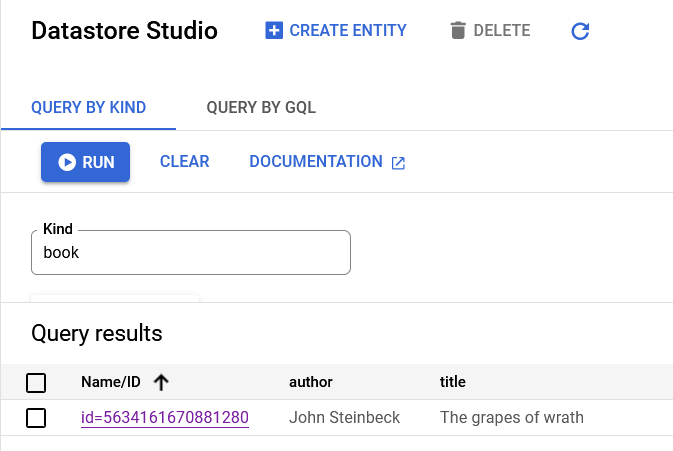)

Cette entité a été écrite dans Datastore en utilisant le nouveau contrôleur que nous avons intégré à notre application web. Après avoir déployé l'application sur Google App Engine et accédé au point de terminaison, l'entité a été enregistrée avec succès et est visible dans Datastore Studio, prouvant ainsi le fonctionnement correct de notre contrôleur et la connectivité avec Google Cloud Datastore.

### Tâche 3 : Développement d'un contrôleur pour écrire des entités arbitraires dans Datastore

#### Délivrables Tâche 3

- **Liste du code de l'application :** Nous avons ajouté un contrôleur à notre application Spring Boot qui gère les écritures d'entités arbitraires dans Google Cloud Datastore. Le contrôleur extrait les données des paramètres de la requête URL et crée une entité dans Datastore en utilisant ces informations. Une vérification est effectuée pour s'assurer que le paramètre `_kind` est présent; en l'absence de ce paramètre, un message d'erreur est retourné à l'utilisateur pour indiquer que le type de l'entité est manquant.
Voici le code du contrôleur ajouté :

```java
  @GetMapping("/dswrite")
  public String writeEntityToDatastore(@RequestParam Map<String, String> queryParameters) {
  // Extract the kind name and key name from the query parameters
     String kindName = queryParameters.get("_kind");
  if (kindName == null || kindName.isEmpty()) {
   return "Error: '_kind' parameter is missing in the request.";
  }

     String keyName = queryParameters.get("_key");
    
  // Create or retrieve the KeyFactory for the specified kind
  KeyFactory keyFactory = datastore.newKeyFactory().setKind(kindName);
  
  // Create a key for the entity; if a key name is provided use it, otherwise allocate an ID
  Key key = (keyName != null) ? keyFactory.newKey(keyName) : datastore.allocateId(keyFactory.newKey());
  
  // Build the entity using the query parameters
  Entity.Builder entityBuilder = Entity.newBuilder(key);
  for (Map.Entry<String, String> entry : queryParameters.entrySet()) {
   if (!entry.getKey().equals("_kind") && !entry.getKey().equals("_key")) {
    entityBuilder.set(entry.getKey(), entry.getValue());
   }
  }
  
  Entity entity = entityBuilder.build();
  
  // Save the entity to Datastore
  datastore.put(entity);
  
  return "Entity with kind '" + kindName + "' and key id/name '" + (keyName != null ? keyName : key.getId()) + "' has been written to Datastore";
}
```


### Tâche 4: test de la performance des écritures dans le datastore

#### Délivrables Tâche 4

#### controller helloworld

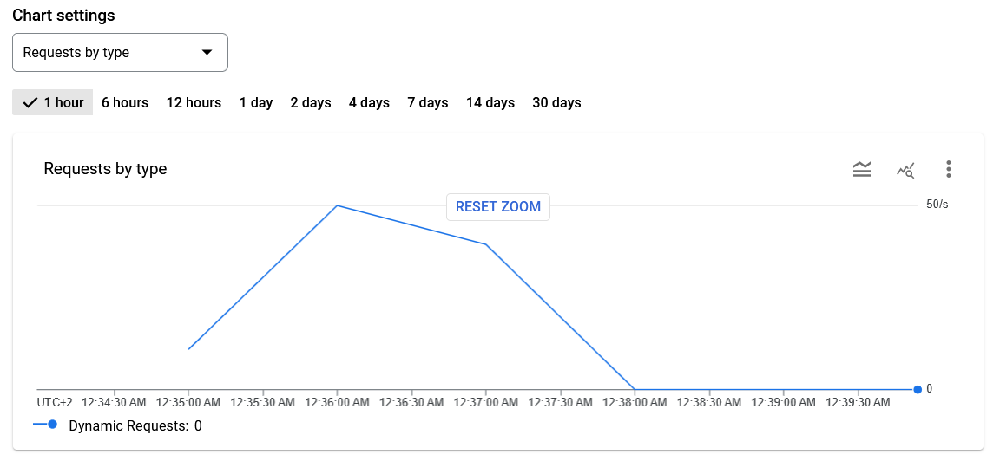
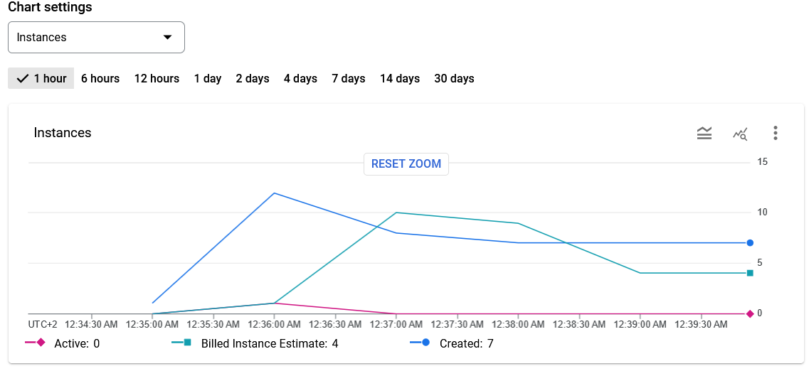
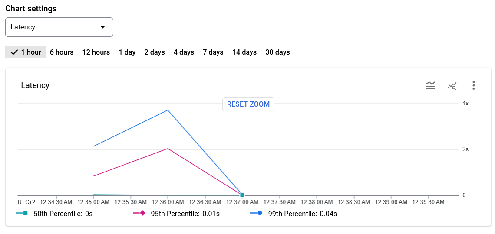
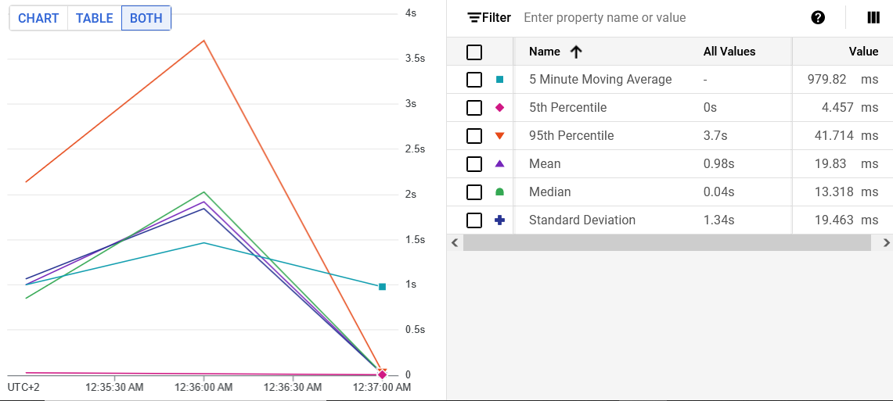

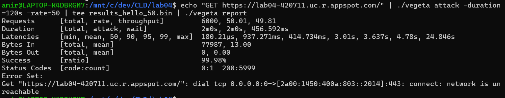
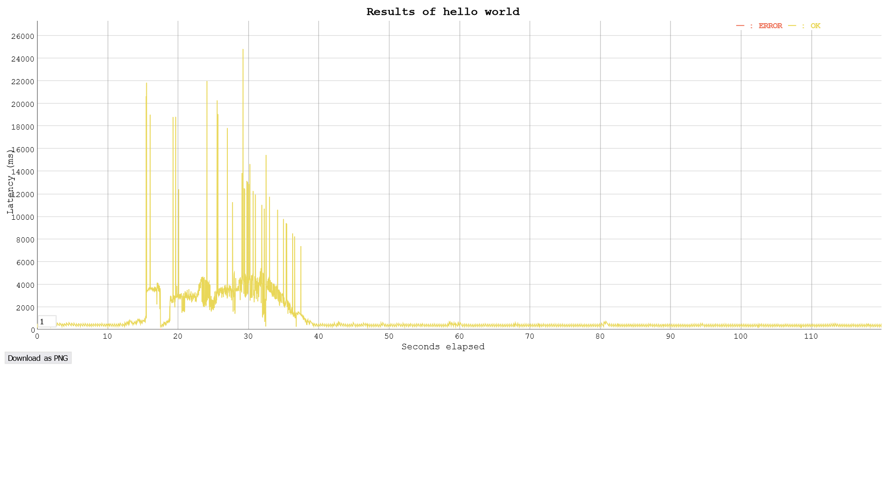

#### controller dswrite

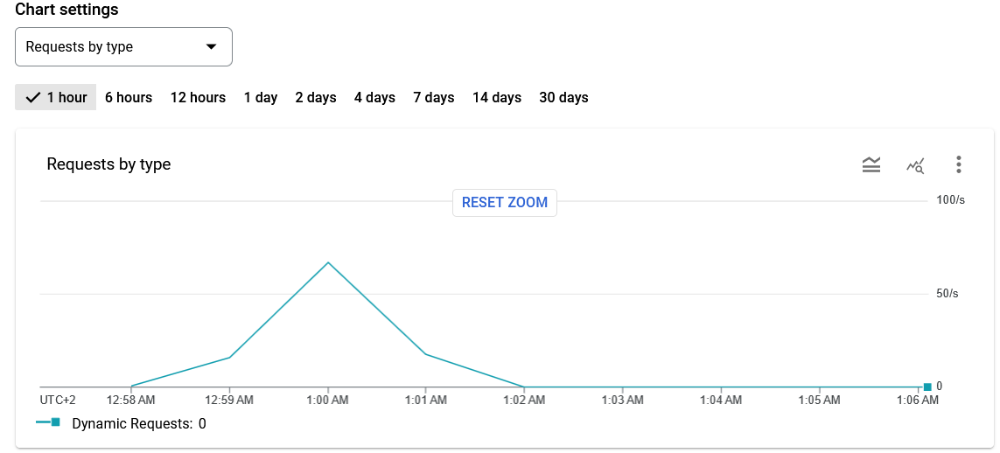
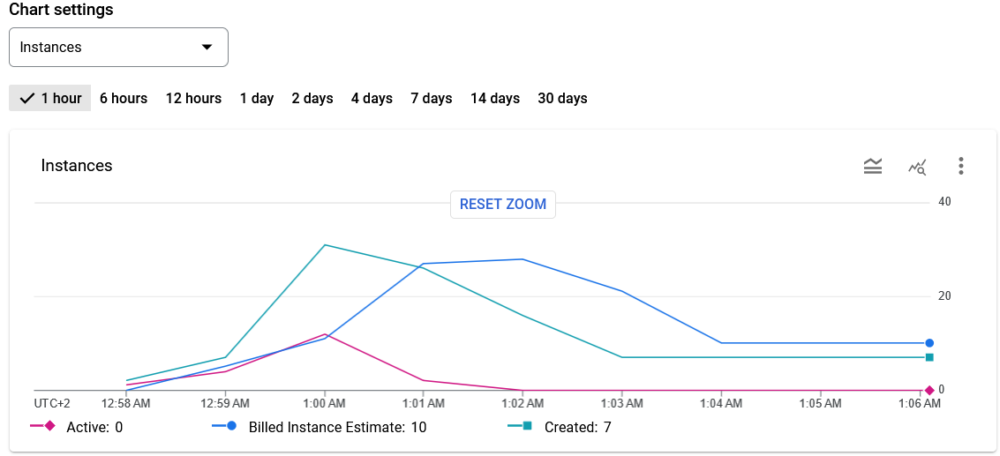
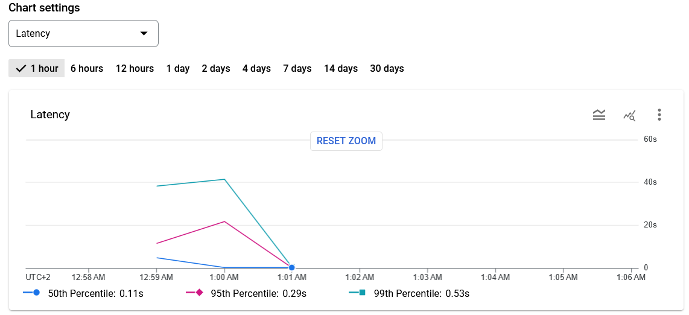
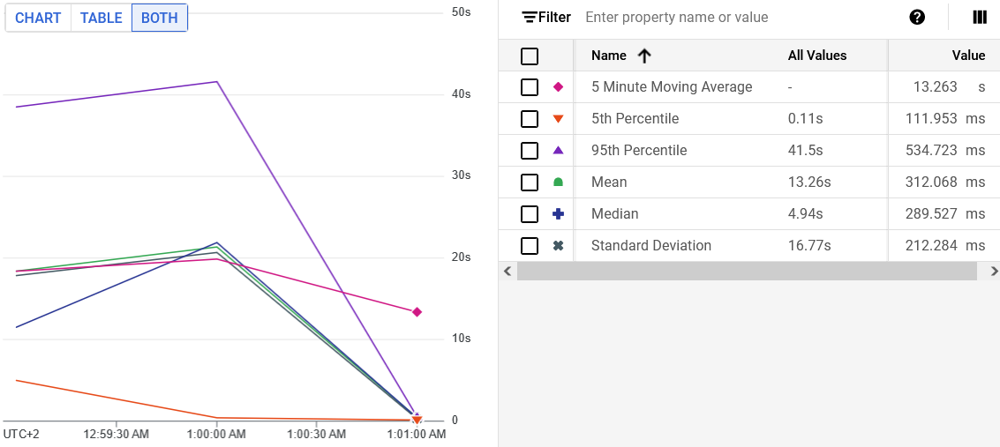

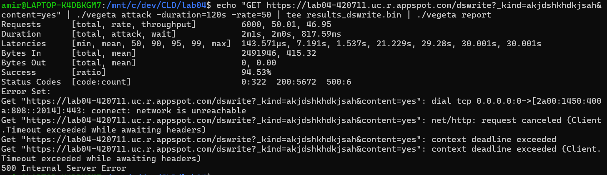
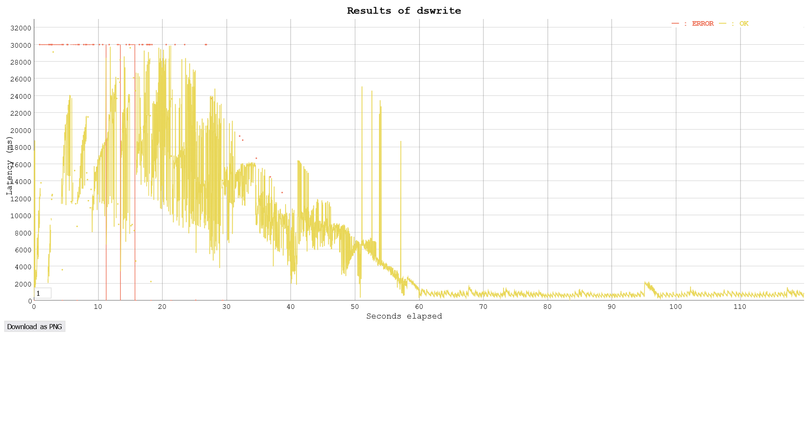

#### What average response times do you observe in the test tool for each controller?:

Environ 0.9 secondes pour le controlleur hello world et environ 7 secondes pour le dswrite

#### Compare the response times shown by the test tool and the App Engine console. Explain the difference:

For the hello world controller, the stats in the google app engine and the vegeta report are very similar.

Pour le controlleur helloworld, les statistiques sur la console google app et dans le rapport de vegeta ont l'air d'être plus ou moins les mêmes.

Par contre, pour dswrite, on observe que la moyenne des latences est beaucoup plus grande sur la console google app que sur dans le rapport de vegeta (13.26 secondes sur la console et 7.19 secondes chez vegeta). On voit aussi que la console a des données avec des latences plus haute que vegeta. Dans le rapport de vegeta, la latence max est 30 secondes alors que sur google app le 95e percentile est à 41.5 secondes.

Cette différence est probablement car vegeta traite les requètes qui prennent trop de temps comme des erreurs et elles n'apparaissent donc pas dans son rapport alors que la console google app les garde car du côté serveur la requète a été traitée. On voit que dans le rapport vegeta, 5.5% des requêtes ont donné des erreurs et dans les erreurs que vegeta a rencontré on voit des erreurs "client timeout exceeded" ce qui supporte cette explication.

#### Let’s suppose you become suspicious that the algorithm for the automatic scaling of instances is not working correctly. Imagine a way in which the algorithm could be broken. Which measures shown in the console would you use to detect this failure?

- Si l'algorithme crée trop d'instances: on peut détecter cette erreur en monitorant l'utilisation du CPU et le nombre d'instances. Si l'algorithme garde beaucoup d'instances en vie mais qu'elles n'utilisent que peu leur CPU, elles ne sont pas nécessaires.

- L'algorithme pourrait créer trop peu d'instances : nous pouvons détecter cela en regardant la latence, les taux d'erreur et le nombre d'instances. S'il y a beaucoup d'erreurs timeout et que le nombre d'instances n'augmente pas il est possible que l'algorithme ne réagit pas correctement à une augmentation de trafic

- Réaction lente aux changements de trafic : nous pouvons détecter cela en observant le nombre de requêtes par seconde et le nombre d'instances (si les instances augmentent trop lentement).