Amir Mouti, Ouweis Harun
# Task 1 Deploy the application on a local test cluster

## Tasks 1.1 and 1.2

We encountered a few issues installing minikube and kubectl but uninstalling both and reinstalling (kubectl installed through gcloud components install) them fixed the problems.

## Task 1.3

minikube start was executed correctly but gave this warning:

```
Unable to resolve the current Docker CLI context "default": context "default": context not found
```

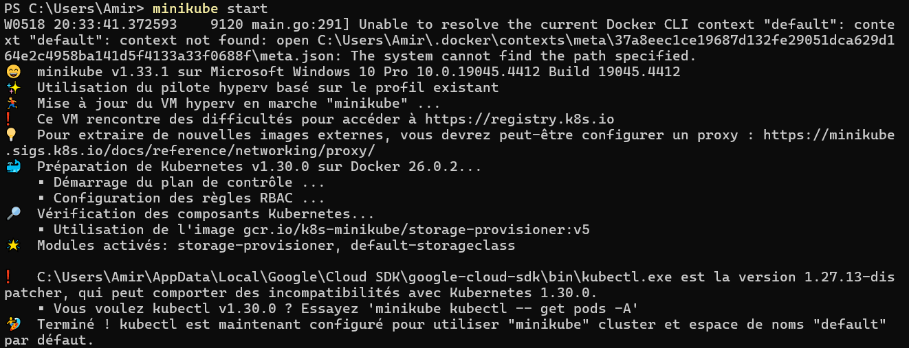

The same warning appeared when using the command minikube dashboard. Running the command

```bash
docker context use default
```

In the terminal fixed this.

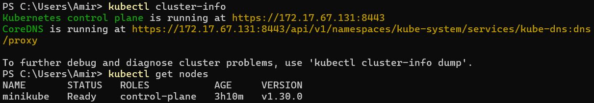

## Task 1.4

No problems were encountered in this task.

## Deploy the Redis Service and Pod


Description of the redis service:
```
PS C:\dev\CLD\lab05> kubectl create -f redis-svc.yaml
service/redis-svc created
PS C:\dev\CLD\lab05> kubectl create -f redis-pod.yaml
pod/redis created
PS C:\dev\CLD\lab05> kubectl describe svc/redis-svc
Namespace:         default
Labels:            component=redis
Annotations:       <none>
Selector:          app=todo,component=redis
Type:              ClusterIP
IP Family Policy:  SingleStack
IP Families:       IPv4
IP:                10.99.51.179
IPs:               10.99.51.179
Port:              redis  6379/TCP
TargetPort:        6379/TCP
Endpoints:         10.244.0.6:6379
Session Affinity:  None
Events:            <none>
```
Description of the redis pod:
```
PS C:\dev\CLD\lab05> kubectl describe pod/redis
Name:             redis
Namespace:        default
Priority:         0
Service Account:  default
Node:             minikube/172.17.67.131
Start Time:       Sun, 19 May 2024 00:28:42 +0200
Labels:           app=todo
                  component=redis
Annotations:      <none>
Status:           Running
IP:               10.244.0.6
IPs:
  IP:  10.244.0.6
Containers:
  redis:
    Container ID:  docker://3389cafd295e3507994281237a707dc9a6d9582acfb5041753ad3b117433d041
    Image:         redis
    Image ID:      docker-pullable://redis@sha256:5a93f6b2e391b78e8bd3f9e7e1e1e06aeb5295043b4703fb88392835cec924a0
    Port:          6379/TCP
    Host Port:     0/TCP
    Args:
      redis-server
      --requirepass ccp2
      --appendonly yes
    State:          Running
      Started:      Sun, 19 May 2024 00:28:49 +0200
    Ready:          True
    Restart Count:  0
    Environment:    <none>
      /var/run/secrets/kubernetes.io/serviceaccount from kube-api-access-676k8 (ro)
Conditions:
  Type                        Status
  PodReadyToStartContainers   True
  Initialized                 True
  Ready                       True
  ContainersReady             True
  PodScheduled                True
Volumes:
  kube-api-access-676k8:
    Type:                    Projected (a volume that contains injected data from multiple sources)
    TokenExpirationSeconds:  3607
    ConfigMapName:           kube-root-ca.crt
    ConfigMapOptional:       <nil>
    DownwardAPI:             true
Tolerations:                 node.kubernetes.io/not-ready:NoExecute op=Exists for 300s
Events:
  ----    ------     ----  ----               -------
  Normal  Scheduled  36s   default-scheduler  Successfully assigned default/redis to minikube
  Normal  Pulling    35s   kubelet            Pulling image "redis"
  Normal  Pulled     29s   kubelet            Successfully pulled image "redis" in 6.6s (6.6s including waiting). Image size: 116496163 bytes.
  Normal  Created    29s   kubelet            Created container redis
  Normal  Started    29s   kubelet            Started container redis
```

## Deploy the ToDo-API Service and Pod

No problems were encountered in deploying the ToDo API service and pod. The api-svc.yaml is created by copying the redis-svc.yaml file, replacing all "redis" strings by "api" and changing both ports to 8081 (given in the instructions and we can see in api-pod.yaml the port is also 8081).

api-svc.yaml file:
```yaml
apiVersion: v1
kind: Service
metadata:
  labels:
    component: api
  name: api-svc
spec:
  ports:
  - port: 8081
    targetPort: 8081
    name: api
  selector:
    app: todo
    component: api
  type: ClusterIP
```

```
PS C:\dev\CLD\lab05> kubectl create -f api-svc.yaml
service/api-svc created
PS C:\dev\CLD\lab05> kubectl create -f api-pod.yaml
pod/api created
PS C:\dev\CLD\lab05> kubectl get all
NAME        READY   STATUS              RESTARTS   AGE
pod/api     0/1     ContainerCreating   0          6s
pod/redis   1/1     Running             0          10m

NAME                 TYPE        CLUSTER-IP      EXTERNAL-IP   PORT(S)    AGE
service/api-svc      ClusterIP   10.110.92.159   <none>        8081/TCP   19s
service/kubernetes   ClusterIP   10.96.0.1       <none>        443/TCP    4h4m
service/redis-svc    ClusterIP   10.99.51.179    <none>        6379/TCP   10m
```
Description of the api service:
```
PS C:\dev\CLD\lab05> kubectl describe service/api-svc
Name:              api-svc
Namespace:         default
Labels:            component=api
Annotations:       <none>
Selector:          app=todo,component=api
Type:              ClusterIP
IP Family Policy:  SingleStack
IP Families:       IPv4
IP:                10.110.92.159
IPs:               10.110.92.159
Port:              api  8081/TCP
TargetPort:        8081/TCP
Endpoints:         10.244.0.7:8081
Session Affinity:  None
Events:            <none>
```
Description of the api pod:
```
PS C:\dev\CLD\lab05> kubectl describe pod/api
Name:             api
Namespace:        default
Priority:         0
Service Account:  default
Node:             minikube/172.17.67.131
Start Time:       Sun, 19 May 2024 00:38:48 +0200
Labels:           app=todo
                  component=api
Annotations:      <none>
Status:           Pending
IP:
IPs:              <none>
Containers:
  api:
    Container ID:
    Image:          icclabcna/ccp2-k8s-todo-api
    Image ID:
    Port:           8081/TCP
    Host Port:      0/TCP
    State:          Waiting
      Reason:       ContainerCreating
    Ready:          False
    Environment:
      REDIS_PWD:       ccp2
    Mounts:
      /var/run/secrets/kubernetes.io/serviceaccount from kube-api-access-c6bm2 (ro)
Conditions:
  Type                        Status
  PodReadyToStartContainers   False
  Initialized                 True
  Ready                       False
  ContainersReady             False
  PodScheduled                True
Volumes:
  kube-api-access-c6bm2:
    Type:                    Projected (a volume that contains injected data from multiple sources)
    TokenExpirationSeconds:  3607
    ConfigMapName:           kube-root-ca.crt
    DownwardAPI:             true
Node-Selectors:              <none>
Tolerations:                 node.kubernetes.io/not-ready:NoExecute op=Exists for 300s
                             node.kubernetes.io/unreachable:NoExecute op=Exists for 300s
Events:
  Type    Reason     Age   From               Message
  ----    ------     ----  ----               -------
  Normal  Pulling    33s   kubelet            Pulling image "icclabcna/ccp2-k8s-todo-api"
```

## Deploy the Frontend Pod

Here is the frontend-pod.yaml configuration file. The value of API_ENDPOINT_URL has to be the address of the api service inside of the cluster, so: "http://api-svc:8081"

```yaml
apiVersion: v1
kind: Pod
metadata:
  name: frontend
  labels:
    component: frontend
    app: todo
spec:
  containers:
  - name: frontend
    image: icclabcna/ccp2-k8s-todo-frontend
    ports:
    - containerPort: 8080
    env:
    - name: API_ENDPOINT_URL
      value: "http://api-svc:8081"
```


Description of the frontend pod:
```
PS C:\dev\CLD\lab05> kubectl describe pod/frontend
Name:             frontend
Namespace:        default
Priority:         0
Service Account:  default
Node:             minikube/172.17.67.131
Start Time:       Sun, 19 May 2024 01:55:47 +0200
Labels:           app=todo
                  component=frontend
Annotations:      <none>
Status:           Running
IP:               10.244.0.8
IPs:
  IP:  10.244.0.8
Containers:
  frontend:
    Container ID:   docker://010696315ce9c87a7217ba2c0197028162dbaf0218fafb6dfb0691e673c9e03a
    Image:          icclabcna/ccp2-k8s-todo-frontend
    Image ID:       docker-pullable://icclabcna/ccp2-k8s-todo-frontend@sha256:5892b8f75a4dd3aa9d9cf527f8796a7638dba574ea8e6beef49360a3c67bbb44
    Port:           8080/TCP
    Host Port:      0/TCP
    State:          Running
      Started:      Sun, 19 May 2024 01:55:58 +0200
    Ready:          True
    Restart Count:  0
    Environment:
      API_ENDPOINT_URL:  http://api-svc:8081
    Mounts:
      /var/run/secrets/kubernetes.io/serviceaccount from kube-api-access-ztvls (ro)
Conditions:
  Type                        Status
  PodReadyToStartContainers   True
  Initialized                 True
  Ready                       True
  ContainersReady             True
  PodScheduled                True
Volumes:
  kube-api-access-ztvls:
    Type:                    Projected (a volume that contains injected data from multiple sources)
    TokenExpirationSeconds:  3607
    ConfigMapName:           kube-root-ca.crt
    ConfigMapOptional:       <nil>
    DownwardAPI:             true
QoS Class:                   BestEffort
Node-Selectors:              <none>
Tolerations:                 node.kubernetes.io/not-ready:NoExecute op=Exists for 300s
                             node.kubernetes.io/unreachable:NoExecute op=Exists for 300s
Events:                      <none>
```

## Verify the ToDo application

Using "kubectl port-forward frontend 8001:8080", we can connect to the app and check that it works:

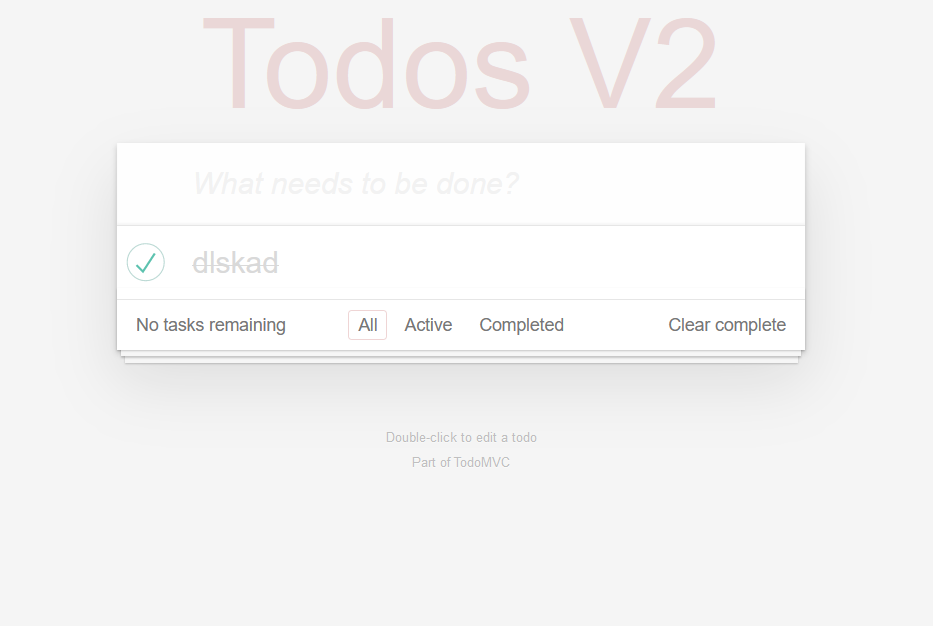

# Task 2 Deploy the application in Kubernetes Engine

## Task 2.2 Create a cluster

There were no issues creating a cluster.

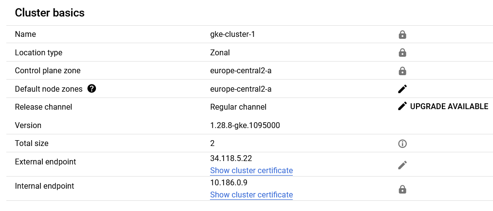
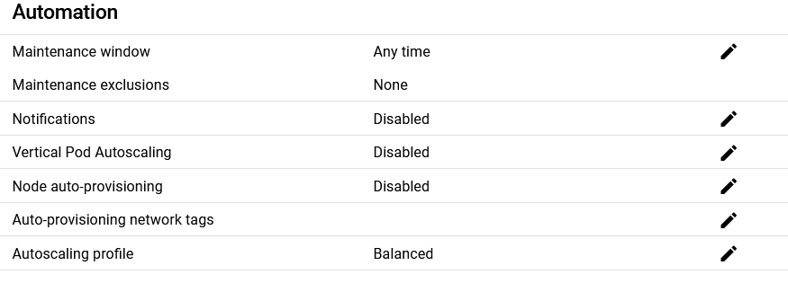
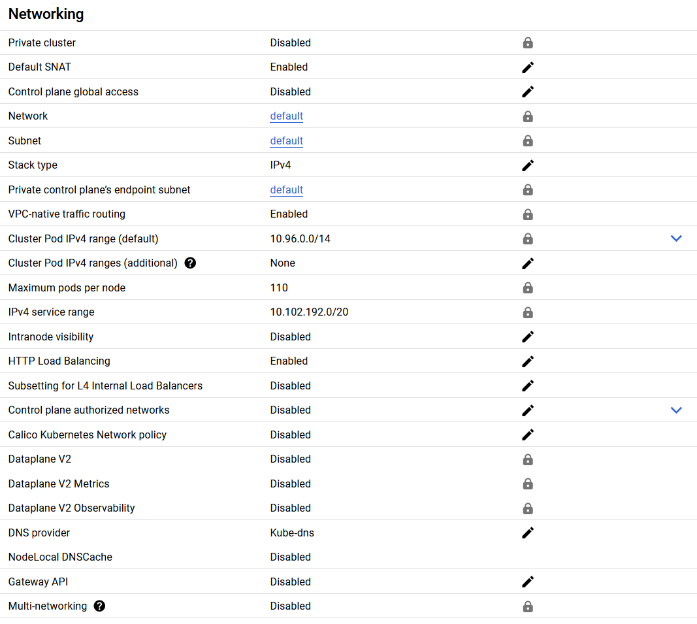
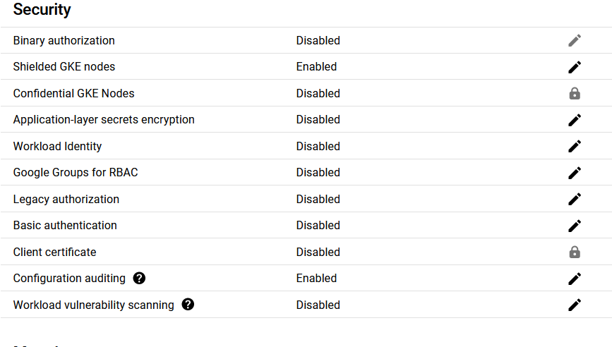

## Task 2.3 Deploy the application on the cluster

There weren't any issues deploying the app.

Description of the frontend pod:

```
PS C:\dev\CLD\lab05> kubectl describe pod/frontend
Name:             frontend
Namespace:        default
Priority:         0
Service Account:  default
Node:             gke-gke-cluster-1-default-pool-f559ea66-86qb/10.186.0.10
Start Time:       Sun, 19 May 2024 18:09:24 +0200
Labels:           app=todo
                  component=frontend
Annotations:      <none>
Status:           Running
IP:               10.96.0.5
IPs:
  IP:  10.96.0.5
Containers:
  frontend:
    Container ID:   containerd://cdf2dd65951fa2e7f02ef09241706670f12f3678896f4dbce09487debbccec68
    Image:          icclabcna/ccp2-k8s-todo-frontend
    Image ID:       docker.io/icclabcna/ccp2-k8s-todo-frontend@sha256:5892b8f75a4dd3aa9d9cf527f8796a7638dba574ea8e6beef49360a3c67bbb44
    Port:           8080/TCP
    Host Port:      0/TCP
    State:          Running
      Started:      Sun, 19 May 2024 18:09:55 +0200
    Ready:          True
    Restart Count:  0
    Environment:
      API_ENDPOINT_URL:  http://api-svc:8081
    Mounts:
      /var/run/secrets/kubernetes.io/serviceaccount from kube-api-access-fcrqx (ro)
Conditions:
  Type              Status
  Initialized       True
  Ready             True
  ContainersReady   True
  PodScheduled      True
Volumes:
  kube-api-access-fcrqx:
    Type:                    Projected (a volume that contains injected data from multiple sources)
    TokenExpirationSeconds:  3607
    ConfigMapName:           kube-root-ca.crt
    ConfigMapOptional:       <nil>
    DownwardAPI:             true
QoS Class:                   BestEffort
Node-Selectors:              <none>
Tolerations:                 node.kubernetes.io/not-ready:NoExecute op=Exists for 300s
                             node.kubernetes.io/unreachable:NoExecute op=Exists for 300s
Events:
  Type    Reason     Age    From               Message
  ----    ------     ----   ----               -------
  Normal  Scheduled  7m44s  default-scheduler  Successfully assigned default/frontend to gke-gke-cluster-1-default-pool-f559ea66-86qb
  Normal  Pulling    7m43s  kubelet            Pulling image "icclabcna/ccp2-k8s-todo-frontend"
  Normal  Pulled     7m14s  kubelet            Successfully pulled image "icclabcna/ccp2-k8s-todo-frontend" in 28.897s (28.898s including waiting)
  Normal  Created    7m14s  kubelet            Created container frontend
  Normal  Started    7m13s  kubelet            Started container frontend
```
Description of the api pod and service:

```
PS C:\dev\CLD\lab05> kubectl describe svc/api-svc
Name:              api-svc
Namespace:         default
Labels:            component=api
Annotations:       cloud.google.com/neg: {"ingress":true}
Selector:          app=todo,component=api
Type:              ClusterIP
IP Family Policy:  SingleStack
IP Families:       IPv4
IP:                10.102.199.233
IPs:               10.102.199.233
Port:              api  8081/TCP
TargetPort:        8081/TCP
Endpoints:         10.96.1.9:8081
Session Affinity:  None
Events:            <none>
```
```
PS C:\dev\CLD\lab05> kubectl describe pod/api
Name:             api
Namespace:        default
Priority:         0
Service Account:  default
Node:             gke-gke-cluster-1-default-pool-f559ea66-3llp/10.186.0.11
Start Time:       Sun, 19 May 2024 18:08:48 +0200
Labels:           app=todo
                  component=api
Annotations:      <none>
Status:           Running
IP:               10.96.1.9
IPs:
  IP:  10.96.1.9
Containers:
  api:
    Container ID:   containerd://9ca0ec0bdcdcf3a905db20a5958759200a4b03db7a15f5168748c6c52b5e3c9e
    Image:          icclabcna/ccp2-k8s-todo-api
    Image ID:       docker.io/icclabcna/ccp2-k8s-todo-api@sha256:13cb50bc9e93fdf10b4608f04f2966e274470f00c0c9f60815ec8fc987cd6e03
    Port:           8081/TCP
    State:          Running
      Started:      Sun, 19 May 2024 18:09:11 +0200
    Ready:          True
    Restart Count:  0
    Environment:
      REDIS_ENDPOINT:  redis-svc
      REDIS_PWD:       ccp2
    Mounts:
      /var/run/secrets/kubernetes.io/serviceaccount from kube-api-access-tqzsg (ro)
Conditions:
  Type              Status
  Initialized       True
  Ready             True
  ContainersReady   True
  PodScheduled      True
Volumes:
  kube-api-access-tqzsg:
    Type:                    Projected (a volume that contains injected data from multiple sources)
    TokenExpirationSeconds:  3607
    ConfigMapName:           kube-root-ca.crt
    ConfigMapOptional:       <nil>
    DownwardAPI:             true
QoS Class:                   BestEffort
Node-Selectors:              <none>
Tolerations:                 node.kubernetes.io/not-ready:NoExecute op=Exists for 300s
                             node.kubernetes.io/unreachable:NoExecute op=Exists for 300s
Events:
  Type    Reason     Age    From               Message
  ----    ------     ----   ----               -------
  Normal  Scheduled  10m    default-scheduler  Successfully assigned default/api to gke-gke-cluster-1-default-pool-f559ea66-3llp
  Normal  Pulling    10m    kubelet            Pulling image "icclabcna/ccp2-k8s-todo-api"
  Normal  Pulled     9m50s  kubelet            Successfully pulled image "icclabcna/ccp2-k8s-todo-api" in 21.839s (21.839s including waiting)
  Normal  Created    9m50s  kubelet            Created container api
  Normal  Started    9m50s  kubelet            Started container api
```

Description of the redis pod and service:

```
PS C:\dev\CLD\lab05> kubectl describe svc/redis-svc
Name:              redis-svc
Namespace:         default
Labels:            component=redis
Annotations:       cloud.google.com/neg: {"ingress":true}
Selector:          app=todo,component=redis
Type:              ClusterIP
IP Family Policy:  SingleStack
IP Families:       IPv4
IP:                10.102.202.88
IPs:               10.102.202.88
Port:              redis  6379/TCP
TargetPort:        6379/TCP
Endpoints:         10.96.1.8:6379
Session Affinity:  None
Events:            <none>
```
```
PS C:\dev\CLD\lab05> kubectl describe pod/redis
Name:             redis
Namespace:        default
Priority:         0
Service Account:  default
Node:             gke-gke-cluster-1-default-pool-f559ea66-3llp/10.186.0.11
Start Time:       Sun, 19 May 2024 18:08:30 +0200
Labels:           app=todo
                  component=redis
Annotations:      <none>
Status:           Running
IP:               10.96.1.8
IPs:
  IP:  10.96.1.8
Containers:
  redis:
    Container ID:  containerd://4203d818b57bbcb58b0248642183bc85015f7c214fabf0e7f6cfa95b54b01a59
    Image:         redis
    Image ID:      docker.io/library/redis@sha256:5a93f6b2e391b78e8bd3f9e7e1e1e06aeb5295043b4703fb88392835cec924a0
    Port:          6379/TCP
    Host Port:     0/TCP
    Args:
      redis-server
      --requirepass ccp2
      --appendonly yes
    State:          Running
      Started:      Sun, 19 May 2024 18:08:37 +0200
    Ready:          True
    Restart Count:  0
    Environment:    <none>
    Mounts:
      /var/run/secrets/kubernetes.io/serviceaccount from kube-api-access-wz4zx (ro)
Conditions:
  Type              Status
  Initialized       True
  Ready             True
  ContainersReady   True
  PodScheduled      True
Volumes:
  kube-api-access-wz4zx:
    Type:                    Projected (a volume that contains injected data from multiple sources)
    TokenExpirationSeconds:  3607
    ConfigMapName:           kube-root-ca.crt
    ConfigMapOptional:       <nil>
    DownwardAPI:             true
QoS Class:                   BestEffort
Node-Selectors:              <none>
Tolerations:                 node.kubernetes.io/not-ready:NoExecute op=Exists for 300s
                             node.kubernetes.io/unreachable:NoExecute op=Exists for 300s
Events:
  Type    Reason     Age   From               Message
  ----    ------     ----  ----               -------
  Normal  Scheduled  10m   default-scheduler  Successfully assigned default/redis to gke-gke-cluster-1-default-pool-f559ea66-3llp
  Normal  Pulling    10m   kubelet            Pulling image "redis"
  Normal  Pulled     10m   kubelet            Successfully pulled image "redis" in 5.45s (5.451s including waiting)
  Normal  Created    10m   kubelet            Created container redis
  Normal  Started    10m   kubelet            Started container redis
```

## Task 2.4 Deploy the ToDo-Frontend Service

We had a small issue when making the yaml, we forgot to replace a "redis" for "frontend" after copying the config file redis-svc.yaml to make the frontend one which caused it to not work. We fixed that problem and changed the config with the command:

```bash
kubectl apply -f frontend-svc.yaml
```

Here is the frontend-svc.yaml file:
```yaml
apiVersion: v1
kind: Service
metadata:
  labels:
    component: frontend
  name: frontend-svc
spec:
  ports:
  - port: 80
    targetPort: 8080
    name: http
  selector:
    app: todo
    component: frontend
  type: LoadBalancer
```

Description of the load balancer:
```
PS C:\dev\CLD\lab05> kubectl describe svc/frontend-svc
Name:                     frontend-svc
Namespace:                default
Labels:                   component=frontend
Annotations:              cloud.google.com/neg: {"ingress":true}
Selector:                 app=todo,component=frontend
Type:                     LoadBalancer
IP Family Policy:         SingleStack
IP Families:              IPv4
IP:                       10.102.201.58
IPs:                      10.102.201.58
LoadBalancer Ingress:     34.116.182.25
Port:                     http  80/TCP
TargetPort:               8080/TCP
NodePort:                 http  32067/TCP
Endpoints:                10.96.0.5:8080
Session Affinity:         None
External Traffic Policy:  Cluster
Events:
  Type    Reason                Age                From                Message
  ----    ------                ----               ----                -------
  Normal  EnsuringLoadBalancer  25s (x2 over 18m)  service-controller  Ensuring load balancer
  Normal  EnsuredLoadBalancer   21s (x2 over 17m)  service-controller  Ensured load balancer
```

The web app is running at the address http://34.116.182.25/

We can verify that it is running correctly:

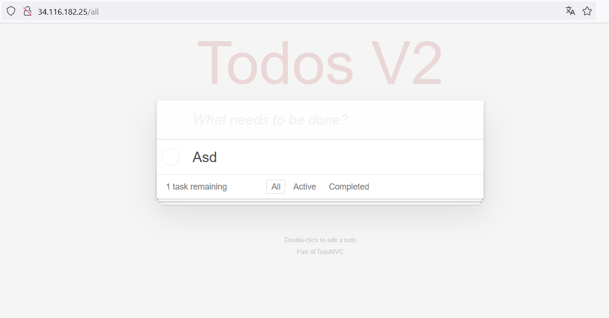

# Task 3 Add and exercise resilience

## Task 3.1 Add Deployments

There were no problems adding the deployments

Here are the config files for the deployments:

redis:
```yaml
apiVersion: apps/v1
kind: Deployment
metadata:
  name: redis-deployment
  labels:
    component: redis
    app: todo
spec:
  replicas: 1
  selector:
    matchLabels:
      app: todo
      component: redis  
  template:
    metadata:
      name: redis
      labels:
        component: redis
        app: todo
    spec:
      containers:
      - name: redis
        image: redis
        ports:
        - containerPort: 6379
        args:
        - redis-server 
        - --requirepass ccp2 
        - --appendonly yes
```
api:
```yaml
apiVersion: apps/v1
kind: Deployment
metadata:
  name: api-deployment
  labels:
    component: api
    app: todo
spec:
  replicas: 2
  selector:
    matchLabels:
      app: todo
      component: api
  template:
    metadata:
      name: api
      labels:
        component: api
        app: todo
    spec:
      containers:
      - name: api
        image: icclabcna/ccp2-k8s-todo-api
        ports:
        - containerPort: 8081
        env:
        - name: REDIS_ENDPOINT
          value: redis-svc
        - name: REDIS_PWD
          value: ccp2
```
frontend:
```yaml
apiVersion: apps/v1
kind: Deployment
metadata:
  name: frontend-deployment
  labels:
    component: frontend
    app: todo
spec:
  replicas: 2
  selector:
    matchLabels:
      app: todo
      component: frontend
  template:
    metadata:
      name: frontend
      labels:
        component: frontend
        app: todo
    spec:
      containers:
      - name: frontend
        image: icclabcna/ccp2-k8s-todo-frontend
        ports:
        - containerPort: 8080
        env:
        - name: API_ENDPOINT_URL
          value: "http://api-svc:8081"
```

```
PS C:\dev\CLD\lab05> kubectl get all
NAME                                      READY   STATUS    RESTARTS   AGE
pod/api-deployment-6969bc9997-9brf8       1/1     Running   0          100s
pod/api-deployment-6969bc9997-pjpbm       1/1     Running   0          100s
pod/frontend-deployment-5dcd95797-dr4bv   1/1     Running   0          112s
pod/frontend-deployment-5dcd95797-r86fl   1/1     Running   0          112s
pod/redis-deployment-5ffcf7fbfc-ngcw9     1/1     Running   0          105s

NAME                   TYPE           CLUSTER-IP       EXTERNAL-IP     PORT(S)        AGE
service/api-svc        ClusterIP      10.102.199.233   <none>          8081/TCP       83m
service/frontend-svc   LoadBalancer   10.102.201.58    34.116.182.25   80:32067/TCP   63m
service/kubernetes     ClusterIP      10.102.192.1     <none>          443/TCP        95m
service/redis-svc      ClusterIP      10.102.202.88    <none>          6379/TCP       83m

NAME                                  READY   UP-TO-DATE   AVAILABLE   AGE
deployment.apps/api-deployment        2/2     2            2           100s
deployment.apps/frontend-deployment   2/2     2            2           112s
deployment.apps/redis-deployment      1/1     1            1           105s

NAME                                            DESIRED   CURRENT   READY   AGE
replicaset.apps/api-deployment-6969bc9997       2         2         2       100s
replicaset.apps/frontend-deployment-5dcd95797   2         2         2       112s
replicaset.apps/redis-deployment-5ffcf7fbfc     1         1         1       105s
```

Description of the redis deployment:

```
PS C:\dev\CLD\lab05> kubectl describe deployment/redis-deployment
Name:                   redis-deployment
Namespace:              default
CreationTimestamp:      Sun, 19 May 2024 19:30:01 +0200
Labels:                 app=todo
                        component=redis
Annotations:            deployment.kubernetes.io/revision: 1
Selector:               app=todo,component=redis
Replicas:               1 desired | 1 updated | 1 total | 1 available | 0 unavailable
StrategyType:           RollingUpdate
MinReadySeconds:        0
RollingUpdateStrategy:  25% max unavailable, 25% max surge
Pod Template:
  Labels:  app=todo
           component=redis
  Containers:
   redis:
    Image:      redis
    Port:       6379/TCP
    Host Port:  0/TCP
    Args:
      redis-server
      --requirepass ccp2
      --appendonly yes
    Environment:  <none>
    Mounts:       <none>
  Volumes:        <none>
Conditions:
  Type           Status  Reason
  ----           ------  ------
  Available      True    MinimumReplicasAvailable
  Progressing    True    NewReplicaSetAvailable
OldReplicaSets:  <none>
NewReplicaSet:   redis-deployment-5ffcf7fbfc (1/1 replicas created)
Events:          <none>
```

Desription of the api deployment:

```
PS C:\dev\CLD\lab05> kubectl describe deployment/api-deployment
Name:                   api-deployment
Namespace:              default
CreationTimestamp:      Sun, 19 May 2024 19:30:06 +0200
Labels:                 app=todo
                        component=api
Annotations:            deployment.kubernetes.io/revision: 1
Selector:               app=todo,component=api
Replicas:               2 desired | 2 updated | 2 total | 2 available | 0 unavailable
StrategyType:           RollingUpdate
MinReadySeconds:        0
RollingUpdateStrategy:  25% max unavailable, 25% max surge
Pod Template:
  Labels:  app=todo
           component=api
  Containers:
   api:
    Image:      icclabcna/ccp2-k8s-todo-api
    Port:       8081/TCP
    Host Port:  0/TCP
    Environment:
      REDIS_ENDPOINT:  redis-svc
      REDIS_PWD:       ccp2
    Mounts:            <none>
  Volumes:             <none>
Conditions:
  Type           Status  Reason
  ----           ------  ------
  Available      True    MinimumReplicasAvailable
  Progressing    True    NewReplicaSetAvailable
OldReplicaSets:  <none>
NewReplicaSet:   api-deployment-6969bc9997 (2/2 replicas created)
Events:          <none>
```

Description of the frontend deployment:

```
PS C:\dev\CLD\lab05> kubectl describe deployment/frontend-deployment
Name:                   frontend-deployment
Namespace:              default
CreationTimestamp:      Sun, 19 May 2024 19:29:54 +0200
Labels:                 app=todo
                        component=frontend
Annotations:            deployment.kubernetes.io/revision: 1
Selector:               app=todo,component=frontend
Replicas:               2 desired | 2 updated | 2 total | 2 available | 0 unavailable
StrategyType:           RollingUpdate
MinReadySeconds:        0
RollingUpdateStrategy:  25% max unavailable, 25% max surge
Pod Template:
  Labels:  app=todo
           component=frontend
  Containers:
   frontend:
    Image:      icclabcna/ccp2-k8s-todo-frontend
    Port:       8080/TCP
    Host Port:  0/TCP
    Environment:
      API_ENDPOINT_URL:  http://api-svc:8081
    Mounts:              <none>
  Volumes:               <none>
Conditions:
  Type           Status  Reason
  ----           ------  ------
  Available      True    MinimumReplicasAvailable
  Progressing    True    NewReplicaSetAvailable
OldReplicaSets:  <none>
NewReplicaSet:   frontend-deployment-5dcd95797 (2/2 replicas created)
Events:          <none>
```

### Use only 1 instance for the Redis-Server. Why?

We only use 1 instance of the redis server because we don't want to have multiple databases for such a small app. It is unnecessary with the scale of the app and would require to synchronize the databases.

## Task 3.2


- What happens if you delete a Frontend or API Pod? How long does it take for the system to react?

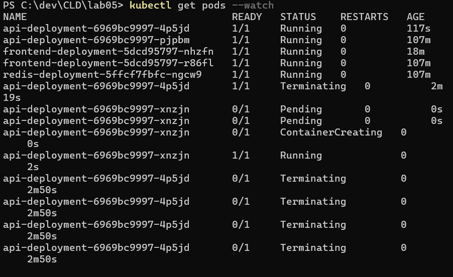

The system immediately puts a new pod in "pending" state. A container is created and enters the state "running" in a few moments. The app keeps functioning through it and we can keep using it without noticing anything.

- What happens when you delete the Redis Pod?

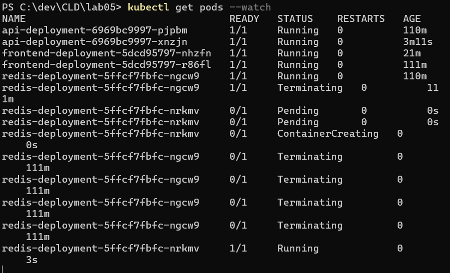

The system also reacts immediately and puts a new pod in "pending" state for it to be created. However we notice all todo items have disappeared as the database was deleted with the pod and the new one is empty. 

- How can you change the number of instances temporarily to 3? Hint: look for scaling in the deployment documentation

with the command "kubectl scale". For example:
```bash
kubectl scale deployment api-deployment --replicas=3
```

- What autoscaling features are available? Which metrics are used?

Horizontal scaling (using a HorizontalPodAutoscaler (HPA)): adjusts the number of replicas based on the observed resource utilization such as CPU or memory usage but custom metrics can also be used.

Vertical scaling (using a VerticalPodAutoscaler (VPA)): Based on resource usage and allows custom metrics as well.

Autoscaling based on cluster size (currently in beta): "While the Cluster Proportional Autoscaler scales the number of replicas of a workload, the Cluster Proportional Vertical Autoscaler adjusts the resource requests for a workload (for example a Deployment or DaemonSet) based on the number of nodes and/or cores in the cluster" (source: kubernetes documentation)

Event driven Autoscaling: Kubernetes Event Driven Autoscaler (KEDA) allows scaling based on the number of events to be processed, for example the amount of messages in a queue.

Autoscaling based on schedules: can be achieved with KEDA, using the Cron scaler that allows us to define schedules and time zones for scaling.

- How can you update a component? (see “Updating a Deployment” in the deployment documentation)

We can update a component with set, apply or edit. Kubectl apply allows us to modify the config file (yaml for example) and then apply the config to an existing deployment while kubectl edit allows us to directly change the config through a text editor.

kubectl set: 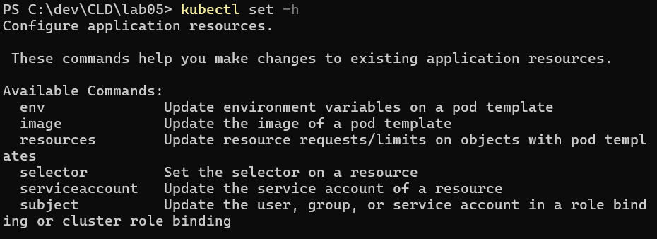

kubectl apply: 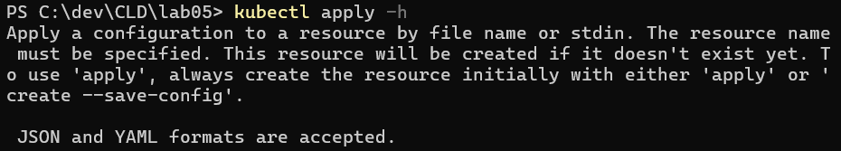

kubectl edit: 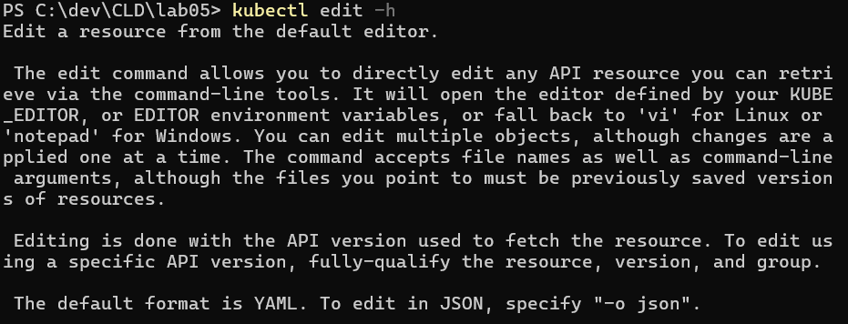

# Task 3.3 Put autoscaling in place and load-test it

The autoscaling couldn't get the cpu metrics, so the manipulation we had to use the command and modify the yaml as instructed.

Modified yaml file:
```yaml
apiVersion: apps/v1
kind: Deployment
metadata:
  name: frontend-deployment
  labels:
    component: frontend
    app: todo
spec:
  replicas: 2
  selector:
    matchLabels:
      app: todo
      component: frontend
  template:
    metadata:
      labels:
        component: frontend
        app: todo
    spec:
      containers:
      - name: frontend
        image: icclabcna/ccp2-k8s-todo-frontend
        ports:
        - containerPort: 8080
        env:
        - name: API_ENDPOINT_URL
          value: "http://api-svc:8081"
        resources: 
          requests: 
            cpu: 10m
```

We can now see the frontend is being scaled properly as there is only one frontend pod when there is no activity:
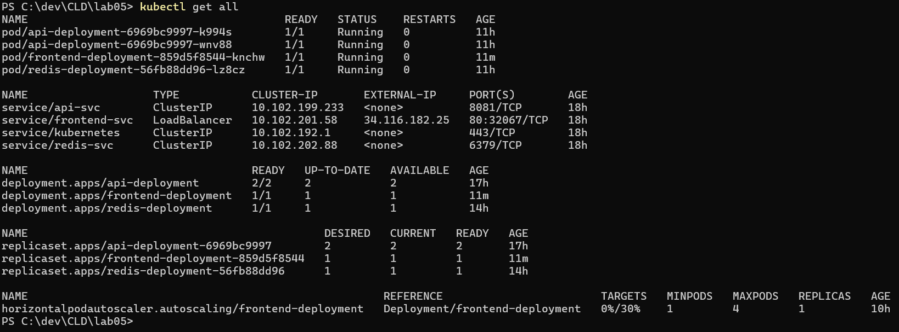

We load tested the app with the vegeta command (500 requests per second):

```bash
echo "GET http://34.116.182.25/all" | vegeta attack -duration=120s -rate=500 | tee results.bin | vegeta report
```

Report:
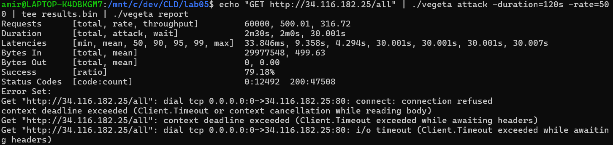
Graph:
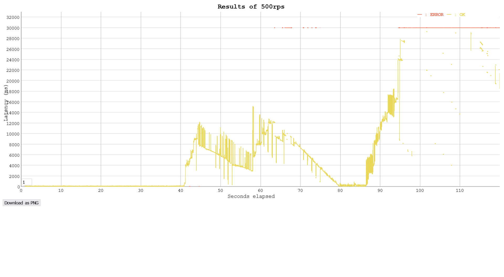

View of "get pods --watch":
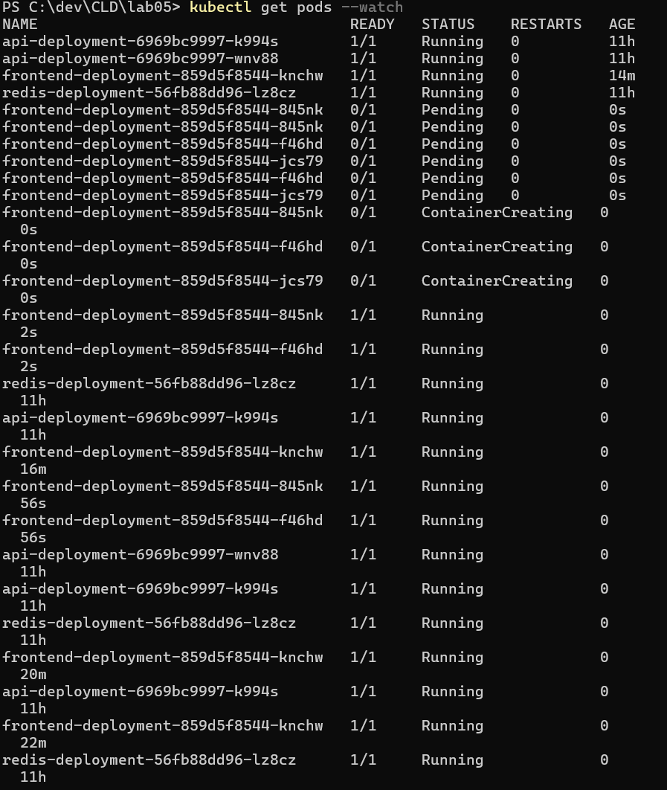

At the start there is a long period with very low latencies which is strange, we are not really sure why that happened.

After that it seems that the scaling is working. On the graph we can see the latencies increasing and then dropping. We assume the decreases happened when a new pod successfully enters the "running" state.

But after some time, the load seems to have been too much for the app to handle and all of them encountered problems. We see that on the graph after around 86 seconds the latency increases until all requests result in errors.

Status of the worload on the gcloud console:

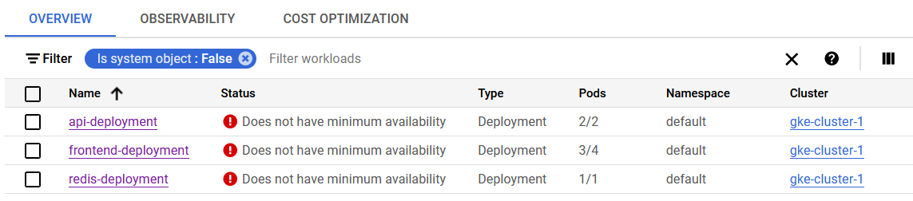

After around an hour, all frontend pods are still stuck with different problems as seen in the next screenshot, but the redis and api pods seem to still be functionning.

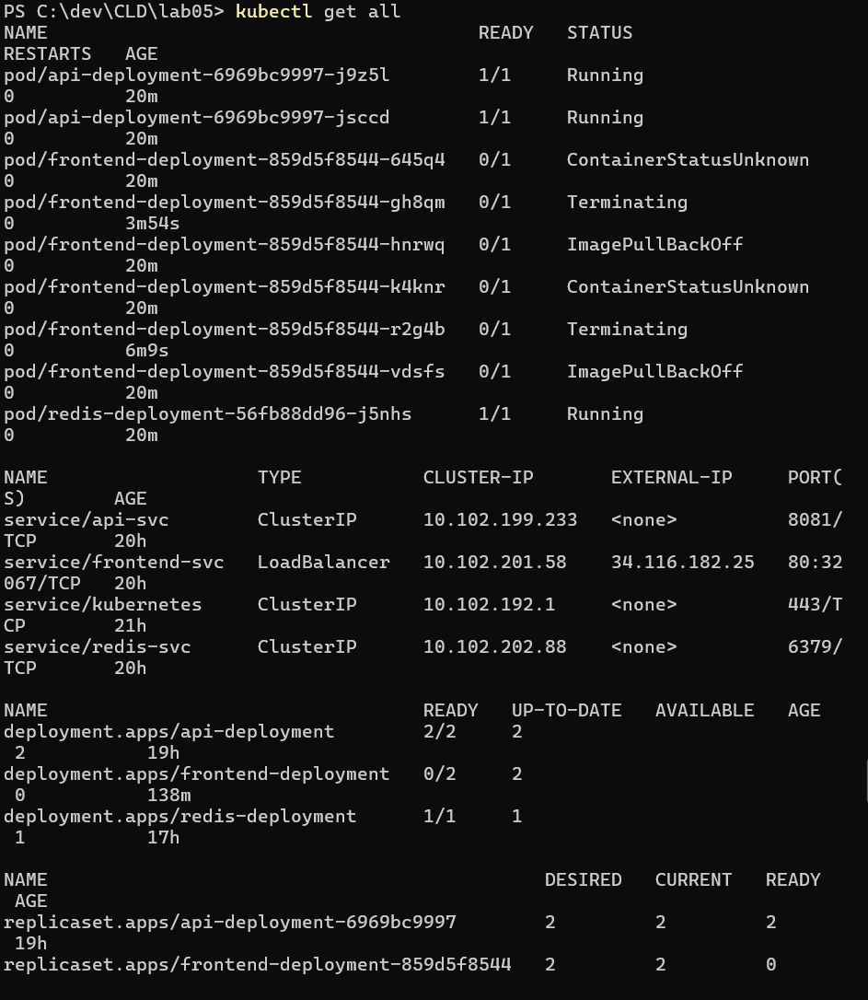